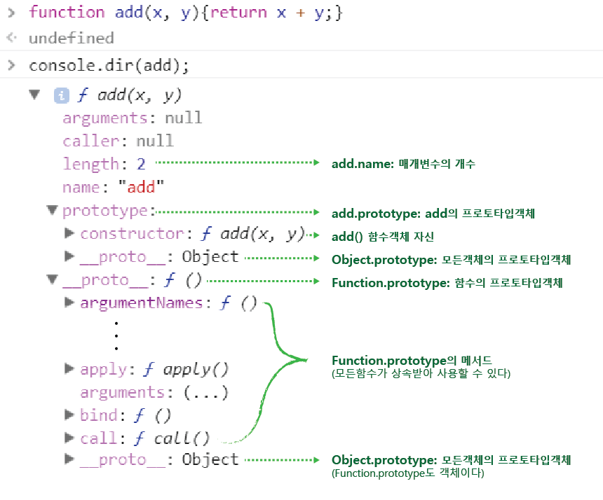

>함수란 어떤 작업을 하기위한 연관된 구문들을 그룹한 것. 함수는 코드의 재사용, 객체생성, 모듈화등에 유용하다. 함수는 일급객체(First-class object)이므로 변수나 객체에 저장되거나 매개변수로 쓰이는등 '값'처럼 사용할 수 있다.

## **함수를 정의하는 3가지 방법**

### 1. 함수선언식   
* **함수명 필수**  
자바스크립트 엔진이 함수선언식을 표현식 형태로 변경하여 함수명으로 함수변수를 만들고, 변수에 함수가 저장된 Memory address(참조값)를 담아 외부적으로 호출 가능하게 해주기 때문
* **세미콜론;을 붙이지 않는다**

### 2. 함수표현식  
변수에 함수를 할당하는 방식(일급객체의 특성)
* **함수명 옵션**  
보통 함수명 생략한다. 함수변수가 함수명처럼 사용되기 때문  
    * 익명함수표현식: 변수로 함수호출
    * 기명함수표현식: 변수로 함수호출. 함수명은 외부접근 불가하므로 재귀적호출등의 용도로만 씀
* **세미콜론;을 붙이도록 강력히 권장**  
자바스크립트의 인터프리터가 자동으로 세미콜론을 붙여주지만, 이것에 의존하면 심각한 디버깅상황이 생길 수 있음 -> [javascript 세미콜론 사용법](https://underbleu.github.io/javascript/semicolon/)

### 3. 생성자함수 Function()  
객체리터럴이 내부적으로 Object() 생성자함수로 만들어 지는 것처럼, 함수선언식과 표현식도 내부적으론 내장함수 Function() 생성자함수로 만들어진다. (객체, 함수리터럴 모두 사용자 편의를 위해 만들어진 것)
* 생성자함수는 Function.prototype.constructor 프로퍼티로 접근할 수 있다.
* 일반적으로 함수를 생성하는 데에는 사용 X

```javascript
//1. Function declaration
function hello(num){
    return num * num;
    } //세미콜론 X

//2. Function expression(named)
var hello = function funcName(num){
    return num * num;
    };//세미콜론 O

console.log(funcName);//ReferenceError
console.log(hello(2));//4

//3. Function() 생성자함수
var hello = new Function('num', 'return num * num');
```

## **함수 호이스팅(Function Hoisting)**
호이스팅이란 자바스크립트 코드를 실행하기 전 var 선언문이나 function 선언문 등을 해당 Scope의 맨 위로 옮기는 것을 말한다

* **함수선언식 -> 함수호이스팅**  
"함수선언 이전에도 함수 호출가능"  
함수선언식은 코드를 실행하기 전 '함수선언, 초기화, 할당'을 한번에 처리하여 VO(variable object)에 저장하기 때문에 함수선언의 위치와 상관없이 어디서든 호출가능하다
* **함수표현식 -> 변수호이스팅**  
"함수선언 이후에만 함수 호출가능"    
함수표현식은 스크립트 로딩 시점에 함수변수만 undefined로 초기화되어 VO에 저장하고(변수호이스팅), 실제함수값은 코드를 만났을 때 할당되기 때문에 함수선언 이후에 호출 가능하다. 그전에 호출하면 undefined
>스크립트로딩 시점에...  
변수는 선언과 초기화만 되고, 함수는 선언과 동시에 할당까지 한방에 됨

### ※ 함수표현식만 사용하도록!   
* 기본은 선언 후 호출(깔끔) -> 함수 호이스팅은 이 규칙을 무시하므로 코드의 구조를 엉성하게 만들 수 있음
* 대규모 애플리케이션을 개발하는 경우 인터프리터가 너무 많은 코드를 변수객체(VO)에 저장하므로 속도 떨어질 수 있음

## **일급객체(first-class object)**
일급 객체란 생성, 대입, 연산, 인자 또는 반환값으로서의 전달 등 프로그래밍 언어의 기본적 조작을 제한없이 사용할 수 있는 대상을 의미한다.  

**자바스크립트에서 함수는 일급객체**이다. 따라서 함수는 기본기능인 코드 실행뿐만 아니라 아래 같은 동작을 할 수 있다. (C에서 함수는 이급객체이다)

>**일급객체의 조건**
1. 변수나 데이터구조(객체, 배열..)에 저장가능
1. 매개변수(parameter)로 전달 가능
1. 반환값(return value)으로 사용 가능
4. 동적으로 프로퍼티 할당이 가능


## **매개변수(parameter)**
매개변수는 함수 내에서 변수와 동일하게 메모리 공간을 확보하며 함수에 전달한 인수는 매개변수에 할당된다.
### 1. parameter vs argument
>**매개변수(parameter)**: "전달받는 값" 함수를 선언할 때 써줌  
**인수(argument)**: "전달하는 값" 함수로 유입되는 입력 값. 함수를 호출할때 써줌

```javascript
//함수선언_parameter입력
function a(parameter){...}
//함수호출_argument입력
a(argument);
```

함수호출시 전달한 인수는 매개변수에 할당된다. 
* 만약 인수를 전달하지 않으면 매개변수는 초기값인 undefined가 된다. 
* 매개변수의 갯수보다 인수를 더 많이 전달한 경우, 초과된 인수는 무시된다.

```javascript
function foo(x, y){return x * y}

foo();//NaN. undefined * undefined
foo(3)//NaN. 3 * undefined
foo(3, 5)//15
foo(3, 5, 6)//15
```

### 2. 인수에 따른 전달방식 
매개변수에 인수를 전달할 때, 이 값이 기본형이냐 참조형이냐에 따라 전달하는 방식의 차이가 있다 (원본값이 바뀌냐 안바뀌냐의 차이)
- Call-by-value  
기본자료형 인수는 값을 복사하여 매개변수에 전달하기 때문에 함수 몸체에서 그 값을 변경하여도 어떠한 부수 효과(side-effect)도 발생시키지 않음
- Call-by-reference  
객체형 인수는 참조값을 매개변수에 전달하기 때문에 함수 몸체에서 그 값을 변경할 경우 원본 객체가 변경되는 부수 효과(side-effect)가 발생

```javascript
function change(num, obj) {
  num += 10;
  obj.age += 10;
}
var num = 10;
var obj = { age: 10 };

console.log(num);//10
console.log(obj.age);//10

change(num, obj);

console.log(num);//10
console.log(obj.age);//20. 변경됨
```
-> 객체형인수를 전달하여 원본객체가 변경되는 side-effect가 발생했다. 이런 부수효과를 발생시키는 함수를 **비순수함수(Impure function)**라 한다. 이는 코드예측성을 떨어트려 디버깅을 어렵게 만든다. 비순수함수를 최대한 줄이도록! 

## **함수객체의 프로퍼티**
함수는 일반 객체와는 다른 함수만의 표준 프로퍼티를 갖는다. 크롬 콘솔창에서 함수add의 속성을 출력해보았다. arguments, caller, length등 다양한 프로퍼티를 가지고있다  



### 1. arguments프로퍼티
함수를 호출할 떄 전달된 arguments들을 담고있는 유사배열 객체이다. 
* apply()메서드를 사용하면 표준 배열 메서드를 활용할 수 있다.
* 원하는만큼 인수를 전달하는 "가변인자함수" 구현할 때  유용함 (아예 파라미터를 비워둠) 

### 2. caller프로퍼티
자신을 호출한 함수를 의미한다

### 3. length프로퍼티
함수를 만들때 정의한 매개변수의 개수를 나타냄(arguments.length는 함수 호출시 인자의 개수)

```javascript
//가변인자함수 sum()
function sum() {
  var res = 0;
  for (var i = 0; i < arguments.length; i++) {
    res += arguments[i];
  }
  console.log(arguments.length);//3 4
  return res;
}
//arguments.length != function.length
sum(1, 2, 3); //3 6
sum(1, 2, 3, 4); //4 10
console.log(sum.length); //0
```
-> sum()은 원하는만큼 인수를 전달하여 총합을 구하는 가변인자함수이다. 두번의 함수호출에서 인자가 각각 3 4개 전달되었으므로 arguments.length가 3 4, 총합이 6 10출력되었다. 매개변수는 지정하지 않았기 때문에 sum.length는 0이다

### 4. name프로퍼티
함수명을 나타내는 프로퍼티. 익명함수는 ""빈문자열을 값으로 가짐

### 5. prototype프로퍼티
* 함수객체만이 가지고 있는 프로퍼티  
* 함수객체가 생성자함수로 만든 함수`foo`의 부모객체`foo.prototype`을 가르킴  
* `foo.prototype.constructor`는 `foo`자신을 가르킴

```javascript
function foo(num){
    return num * num;
}
foo.prototype //foo.prototype
foo.prototype.constructor //foo
foo.__proto__ //Function.prototype
```
-> prototype과 constructor라는 프로퍼티로 서로를 참조한다
### 6. `__proto__`프로퍼티
* 모든 객체가 가지고 있는 프로퍼티   
* 함수객체의 부모를 가르킴`Function.prototype`  
일반객체의 부모객체는 `Object.prototype`

>**`.prototype 프로퍼티`**: 함수객체만 가지고있는 프로퍼티  
**`[[prototype]]`** = **`__proto__`**: 모든 객체가 가지고 있는 프로퍼티  (ECMAScript에서, 크롬에서 표기방법이 다를뿐 같은개념이다.) 

>`__proto__`는 객체입장에서 함수 자신의 부모역할인  "Function.prototype"을  
`.prototype`은 생성자로서 함수가 생성할 객체의 부모역할인 "객체명.prototype"을 가르킨다

>프로토타입체인의 종점은 Object.prototype

## **함수의 종류**
### 1. 콜백함수  
익명함수(anonymous function)의 대표적인 용도
* 특정 함수의 인자로 넘겨서, 코드 내부에서 호출되는 함수  
* 어떤 이벤트가 생기거나 특정시점에 도달했을 때 시스템에서 호출되는 함수  

```javascript
//ex)이벤트 핸들러 처리 
window.onload = function(){
    alert('hello guest');
};
```
### 2. 즉시실행함수(IIFE: Immediate Invoke Function Expression)
* 함수를 정의함과 동시에 바로 실행하는 함수
* 최초 한 번 실행만 필요로하는 **초기화코드**
* jQuery 같은 Js라이브러리, 프레임워크 소스  
-> IIFE안에서 변수들이 독립된 영역을 가지기 때문에 전역 Name Space를 더럽히지 않고, 라이브러리 코드를 동시에 사용하더라도 변수명 충돌 문제X

### 3. 내부함수(Inner Function)
함수 내부에 정의된 함수를 의미한다. 클로저생성, 외부에서 접근을 막는 독립적인 헬퍼함수를 만들 때 사용
1. 내부함수에서 외부함수의 변수에 접근이 가능하다
2. 외부함수에서 내부함수의 변수에 접근은 불가하다
3. 일반적으로 내부함수는 부모함수 내에서만 호출가능하다(Function-Level-Scope)
4. 내부함수를 리턴값으로 받으면, 함수 밖에서도 내부함수 호출가능  
5. 클로저: 실행이 끝난 부모함수 scope의 변수를 참조하는 내부함수를 의미

```javascript
function outter() {
  var a = 1;
  var b = 2;
  function inner() {
    var b = 3;
    //1.외부함수의 변수'a'접근OK
    console.log(a, b);
  }
  function inner2() {
    var c = 4;
    console.log(b, c);
  }
  inner();//1 3
  return inner2;//2 4
}

//3.내부함수는 부모함수내에서만 호출OK
inner(); //ReferenceError

//4.리턴한 내부함수는 밖에서 호출OK 
var bar = outter(); //1 3
bar(); //2 4
```
-> 5. outter함수는 실행되면서 1 3을 뱉어내고, inner2()가 내보낸 b, c만을 리턴값으로 받아 변수bar에 저장한다. 이 때 inner2()는 실행이 종료된 외부함수 outter()의 스코프에 있는 변수b의 값 '2'를 참조하는 **클로저**이다 

