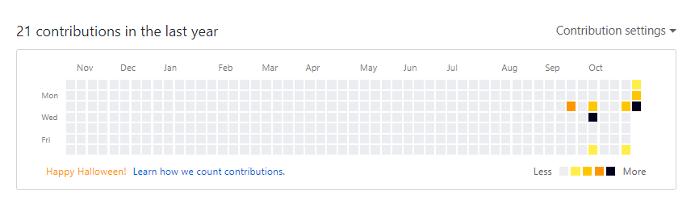

커밋그래프를 초록색으로 뒤덮기 위한 1일1커밋 "8일째"인 오늘!  
공부한 내용을 커밋하고 뿌듯한 마음으로 그래프를 확인 했는데, 이게 왠 일. 타일이 노란색이다. 5일동안 이전 아이디로 커밋 하고있던지라 그래프도 누락 되고있어서 타일 하나하나가 너무 소중한데...! 에러인가 당황스러웠다. 분명히 깃허브는 친절하게 어딘가 설명해줬을거야 살펴 보던와중에 아랫쪽에 작게 보이는 `'Happy Halloween!'`

휴... 귀엽다... 이런게 개발자 개그인가
