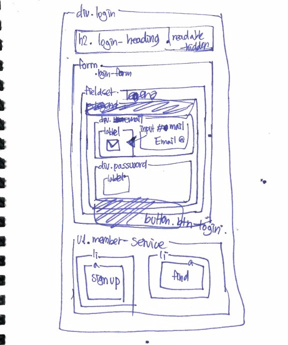
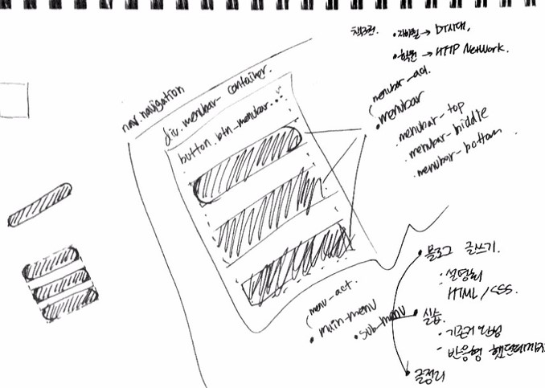
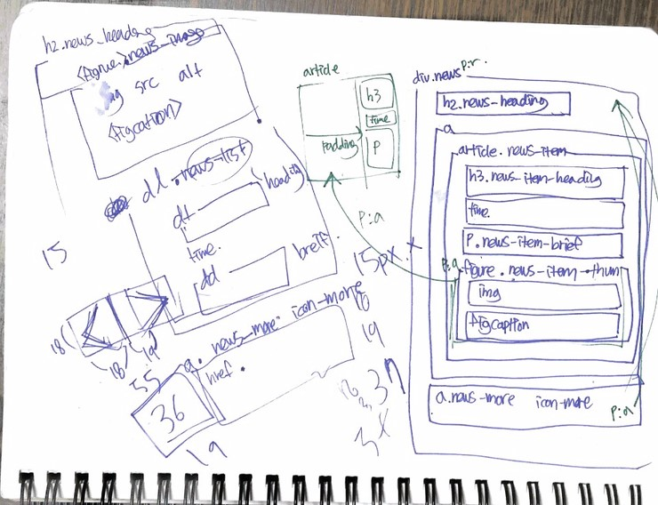
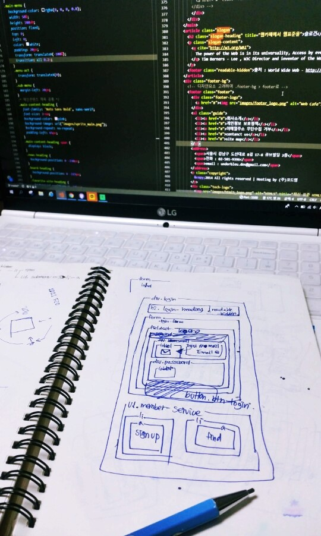

디자인을 해오며 항상 부족함을 느끼던 개발지식.  
'지금이 때'라는 생각에 모든일을 접고, 패스트캠퍼스의 프론트엔드 스쿨에 들어왔다.  
첫 2주, 김데레사 선생님의 html, css수업은 번개처럼 지나갔다!

사실 이전에 국비지원과정으로 2개월간 웹퍼블리셔 과정을 수강한적이 있어서  
첫 2주는 편하게 들을 수 있겠구나 생각했다.  
하지만 이전에 내가 알고있던 html, css와는 완전히 달랐다.  

눈에 보이는 화면만을 구현하기 위해 html태그와 css속성을 표로 뽑아 달달외우고, 영타연습하듯 실습하던 국비학원에 반해  

웹페이지의 구조를 분석하고 논리적인 설계하는 방법을 배웠고,  
이것이 얼마나 페이지의 로딩속도나 검색상위에 노출되는데에큰 영향을 미치는지 알게되었다.   
(검색노출만을 위해 한달에 500~1000만원까지 지불하던 회사가 생각났다)

  
(수업시간에 열심히 짜봤던 구조도)

2주가 되어갈 무렵 선생님의 목소리는 가끔 나오지 않았다  
그만큼 강의를 시작하는 순간 열정적으로 많은걸 알려주셨고,  
그 마음이 와닿았는지 선생님이 해주시는 얘기하나 하나 놓치지 않고 흡수하고 싶었다.  
특히 웹표준과 접근성의 중요성을 강조하시며 실습에 많이 녹여 보여주셨는데,  
등한시했던 이부분에 눈을 뜰 수 있는 계기가 된 것같다.  

  
  
(추천해주신 제프리젤드만의 웹표준가이드 책)
 
 
서비스를 만드는 사람이라면, 그게 개발자이던 디자이너, 기획자이던  
얼마나 다양한 환경의 사용자들이 서비스를 사용하게 될지를 선택이 아닌 필수로   고려해야한다.  
웹표준과 접근성이 무엇인지도 잘 모르고 기획하고 디자인했던 지난날들이 부끄러워지며  
***"기술만이 아닌 개발자로서 갖춰야할 자세도 배울 수 있었던 것같다."***

  
  
2주가 지난 지금까진, 패캠수업에 정말 만족하고있다.
왜 개발자들도 큰비용을 들여 배우러 오는 곳인지 알것같다.
그만큼 수업을해주시는 강사님들이 정말 수준높으시고,
항상 밀착해있는 조교님, 쪽지시험, 액티비티등 공부할 환경이 잘잡혀있다

아, 다만 수업내용이 굉장히 난이도 있었다.
패캠사이트엔 비전공자들도 문제없이 수강할 수 있다고 되어있지만
정말 개발지식이 전혀없다면, 음... 자괴감이 많이 들것같다.

혼자서 독학으로 알아보고 공부할 때와는 깊이가 다른 지식을 수업 중간중간에 여담처럼 들을 수 있는데, 이때 실습에 급급하지 않고 이 여담을 들을정도의 여유가 필요하다.

그래서인지 수업이 끝난 지금 만족하면서도 아쉽다.  
내가 더 알았더라면, 더 많은 것들을 흡수할 수 있지않았을까...  
무튼 정말 꽉차있고, 2주가 이틀처럼 느껴질 정도로 열중했던 시간이었다 :)

